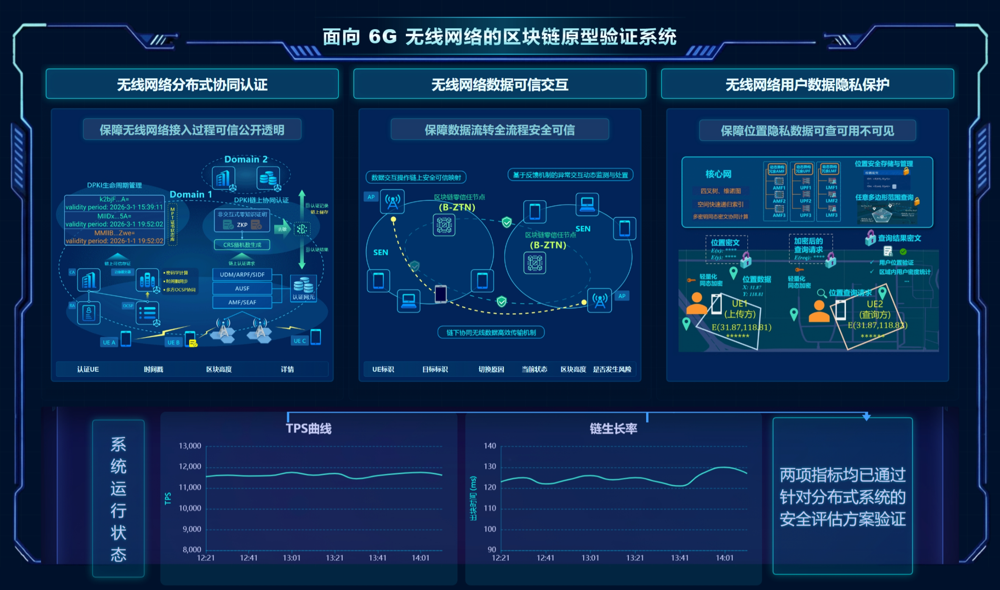

# 北邮前端

**简介**

北邮前端，根据之前的北邮大屏复现得来。最新状态（每次提交更新最新状态，图片在pic/下）：



---

## 🔧 快速预览（任一方式）

- 使用 Python（最简单）：

```bash
# 在项目根运行
python3 -m http.server 8000
# 打开浏览器
http://localhost:8000/index.html
```

- 使用 npx serve（无须额外安装）：

```bash
npx serve -s . -l 8000
```


## 📁 主要文件说明

- `index.html` — 入口页面，加载 CDN 的 Vue / ElementUI / ECharts 并挂载 `/src/app.js` 与 `/src/styles.css`。
- `src/styles.css` — 全局样式（深蓝主题、荧光框、角落装饰、响应式规则）。
- `src/app.js` — 简单的 Vue 实例（dialog 示例、图表示例、嵌入支持逻辑）。
- `assets/img/` — 图像资源（用于 banner、底图、占位图），可直接替换。

---


## ✅ 分工

zyw：左边的表格里面的文字最后改吧，现在还没改完

zhb：调整页面下方的两个折线图以及背景图

wmt：改下背景颜色，融为一体；压低整幅图的尺寸，现在有点太长了


具体实现内容查看ppt，或者看会议录播（https://meeting.tencent.com/crm/2ZDAzRap28）
并随时关注群消息
